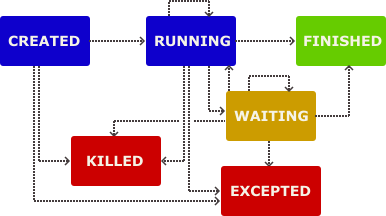

(concepts)=

# Concepts

## Process

The most basic concept in plumpy is the {py:class}`~plumpy.processes.Process`. It utilises the concept of a [finite state machine](https://en.wikipedia.org/wiki/Finite-state_machine) to run a user defined action, transitioning between a set of states:

:::{figure-md}

Process state transitions
:::

A process is an asynchronously running component that is typically defined as a static, "long-running" part of the workflow.

Different processes are able to run asynchronously with each other in an [asyncio event loop](https://docs.python.org/3/library/asyncio-eventloop.html),
so when a process is doing IO jobs, it will not be blocking other process from
running to the terminal state.

## Workchain

A {py:class}`~plumpy.workchains.WorkChain` is a subclass of `Process`, with additional features for running a process as a set of discrete steps (also known as instructions).

A concrete `WorkChain` is created with a series of instructions to be carried out, and has the ability to save the state of the process after each instruction has completed.

The set of instructions is defined in the `outline` method, which provides a succinct summary of the logical steps that the workchain will perform.

WorkChains support the use of logical constructs such as `If_` and `While_` to control the state flow of certain processes.

## Controller

A `Controller` can control processes throughout their lifetime, by sending and receiving messages. It can launch, pause, continue, kill and check status of the process.

The {py:class}`~plumpy.rmq.process_control.RemoteProcessThreadController` can communicate with the process over the thread communicator provided by {{kiwipy}} which can subscribe and send messages over the {{rabbitmq}} message broker.

The thread communicator runs on a independent thread (event loop) and so will not be blocked by sometimes long waiting times in the process event loop.
Using RabbitMQ means that  even if the computer is terminated unexpectedly, messages are persisted and can be run once the computer restarts.
